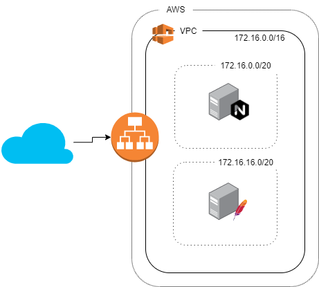

# Devops Challenge

## Requisitos

 - Clone deste repositório
 - Usuário com permissionamento para criação dos recursos na AWS
 - AWS configure ter sido configurado para usuário com permissões para criação de recurso na AWS
 - Terraform v. 0.13.0 ou superior.

Dentro do diretório do terraform.

Inicie o diretório de trabalho do terraform

```bash
$ terraform init
```

Execute o plan para validar se estão correto os parâmetros.

```bash
$ terraform plan
```

Após o plan ok com sua necessidade, faça a aplicação.

```bash
$ terraform apply
```

## Observações

- Para ambiente corporativos é recomendado a utilização de um armazenamento de estado remoto, seja S3 ou Terraform Cloud. Não foi contemplado neste exercício.
- Não foi contemplado a separação de credenciais e diferenciais entre ambientes dev, stage ou prod.
- Não foi utilizado modules, porém se fosse hoje eu usaria.

## Arquitetura


